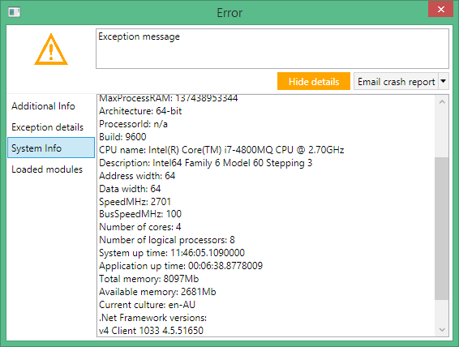

Orc.CrashReporting
======================

[](https://gitter.im/WildGums/Orc.CrashReporting?utm_source=badge&utm_medium=badge&utm_campaign=pr-badge&utm_content=badge)

This library is used to:
- Catch unhandled exceptions
- Prepare a support package (optional)
- Send the crash report to the support team (optional)

This library is available on NuGet.

Features
----------

- **Orc.CrashReporting** will catch all unhandled exceptions automatically
- Crash report providers can be added as plugins
- Reports can be sent by email to a designated email address
- Extra messaging providers can also be implemented

Crash reports will contain:
- The exception message
- The users system information (see [Orc.SystemInfo](https://github.com/WildGums/Orc.SystemInfo) for more details)
- All the DLLs that were loaded when the exception occurred
- Optional message for the user, if they want to add more information before sending the report.

How to add a crash report provider
---------------------------------

All you need to do is implement the **ICrashReportProvider** interface in your project.

```c#
public interface ICrashReportProvider
{
    string Title { get; }
    void SendCrashReport(CrashReport crashReport, string fileToAttach);
}
```

Screenshot
---------------

The error message will look like this:


Clicking on the "Show details" button will display more information.

### Additional info:

This tab gives the user the chance to add extra information before sending the report.


### Exception details:


### System info:



### Loaded modules:


### Sending the report

Multiple messaging providers can be implemented and will be shown in the drop down menu. 

A default email provider is available by default.


License
--------

MIT license
