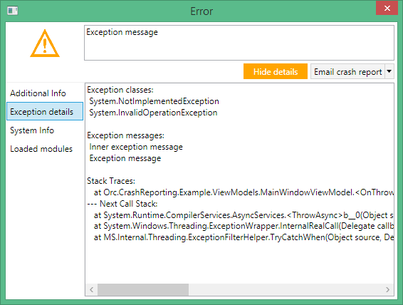

Orc.CrashReporting
======================

This library is used to:
- catch unhandled exceptions
- prepare a support package (optional)
- inform the support team about the crash (optional)

Features
----------

- **Orc.CrashReporting** will catch all unhandled exceptions automatically
- Additional information can be added the report to help identify the cause of the problem
- Crash report providers can be added as plugins
- Reports can be sent by email to a designated email address

How to add a crash report provider
---------------------------------

All you need to do is implement the **ICrashReportProvider** interface in your project.

```c#
public interface ICrashReportProvider
{
    string Title { get; }

    void SendCrashReport(CrashReport crashReport, string fileToAttach);
}
```

Screenshot
---------------

The error message will look like this:


Clicking on the "Show Details" button will display more information, and give the user the chance to add extra information before sending the report.


The exception details:



The system info tab will display all relevant information about the user's computer, and uses the [Orc.SystemInfo](https://github.com/WildGums/Orc.SystemInfo) library.

Multiple report providers can be implemented and shown in the drop down menu to send the crash report:


